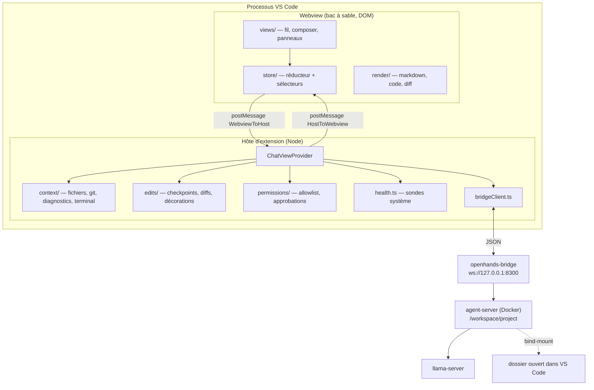
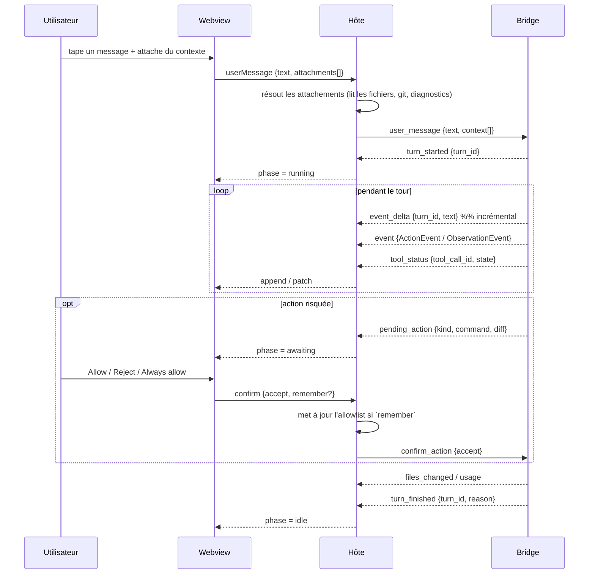

# 01 — Architecture

**Lire si** vous touchez à plus d'une couche, ou si vous ajoutez une capacité qui
franchit la frontière webview↔hôte.

---

## 1. Vue d'ensemble



## 2. Les quatre couches et leurs règles

| Couche | Peut | Ne peut jamais |
|---|---|---|
| **`webview/render`** | transformer une donnée en éléments React | connaître `vscode`, garder de l'état, faire un effet de bord |
| **`webview/views`** | composer des `render`, lire le store, émettre des intentions | appeler `postMessage` directement (passe par le store) |
| **`webview/store`** | détenir l'état, réduire les messages entrants, émettre vers l'hôte | importer React, importer `vscode` |
| **`host/*`** | fs, git, terminal, docker, réseau local, API VS Code | rendre du HTML, formater pour l'affichage |

> **Règle de frontière** : si vous vous surprenez à `import * as vscode` sous
> `src/webview/`, ou à construire du JSX hors de `src/webview/`, la découpe est fausse.
> Un test de discipline le vérifie (05-TESTING §5).

## 3. Le store : un réducteur, pas douze `useState`

État actuel : 12 `useState` dans `App.tsx`, dont trois (`running`, `starting`,
`pendingConfirm`) décrivent la **même** machine à états et peuvent se contredire.

Cible : un état unique, une machine à états explicite.

```ts
type SessionPhase =
  | { kind: "disconnected" }
  | { kind: "picking" }                                   // choix MCP/modèle
  | { kind: "starting" }                                  // sandbox en démarrage
  | { kind: "idle"; conversationId: string }              // prêt à recevoir un message
  | { kind: "running"; conversationId: string; turnId: string; startedAt: number }
  | { kind: "awaiting"; conversationId: string; turnId: string; pending: PendingAction }
  | { kind: "cancelling"; conversationId: string; turnId: string };
```

Invariants (testés) :

1. On ne peut pas entrer dans `running` sans `turnId` venu du bridge.
2. `idle → running` uniquement sur `turn_started` ; `running → idle` uniquement
   sur `turn_finished` ou `error` fatale. **Jamais** sur `usage` ou `files_changed`.
3. `awaiting` n'est atteignable que depuis `running`, et y retourne.
4. La perte de connexion n'efface pas le fil : elle passe en `disconnected` en
   **conservant** `items`, et une reconnexion resynchronise (C01 §6).

## 4. Cycle de vie d'un tour



## 5. Traduction des chemins — sandbox ↔ hôte

**Le piège numéro un de ce repo.** L'agent tourne dans un conteneur ; le dossier
ouvert dans VS Code est bind-monté à `/workspace/project`. Tout chemin dans un
`ActionEvent`, une `ObservationEvent`, un `files_changed` ou un diff est donc
exprimé côté conteneur.

```
sandbox : /workspace/project/src/pricing/black.cpp
hôte    : ${workspaceFolder}/src/pricing/black.cpp
```

Un module unique, `src/paths.ts`, détient cette traduction :

```ts
/** Chemin conteneur → URI hôte. `null` si hors du montage projet. */
export function toHostUri(sandboxPath: string): vscode.Uri | null;
/** URI hôte → chemin conteneur. `null` si hors du dossier ouvert. */
export function toSandboxPath(uri: vscode.Uri): string | null;
/** Chemin relatif court, pour l'affichage. */
export function displayPath(sandboxPath: string): string;
```

Règles :

| Règle |
|---|
| Aucun autre fichier ne concatène `/workspace/project`. Un test de discipline grep ce littéral hors de `paths.ts`. |
| `toHostUri` retourne `null` pour tout ce qui sort du montage (`/tmp`, `/workspace/conversations`, chemins absolus étrangers). L'UI affiche alors un chemin **non cliquable**, elle n'invente pas de cible. |
| Le franchissement de frontière (`..`) est rejeté, pas normalisé silencieusement. |
| Sans `project_path` (aucun dossier ouvert), toutes les traductions retournent `null` et l'UI le dit explicitement. |

## 6. Résolution du contexte : qui fait quoi

La webview manipule des **références** de contexte, jamais du contenu. L'hôte
résout au moment de l'envoi.

```ts
// webview → hôte : léger, sérialisable, affichable en chip
type ContextRef =
  | { kind: "file"; uri: string }
  | { kind: "selection"; uri: string; range: [number, number] }
  | { kind: "symbol"; uri: string; name: string }
  | { kind: "diagnostics"; scope: "file" | "workspace"; uri?: string }
  | { kind: "terminal"; which: "lastCommand" | "selection" }
  | { kind: "git"; what: "status" | "diff" | "log" }
  | { kind: "image"; id: string };

// hôte → bridge : le contenu réel, budgété et tronqué
interface ResolvedContext { kind: string; label: string; body: string; truncated: boolean; }
```

Pourquoi : la webview ne peut pas lire de fichier (P2), et garder le contenu dans
l'état de la webview le ferait persister, grossir et transiter deux fois.

## 7. Ce qui vit côté hôte et pourquoi

| Module | Raison d'être côté hôte |
|---|---|
| `bridgeClient.ts` | `ws` est un module Node |
| `health.ts` | `execFile`, `net`, `fs` |
| `context/*` | API `vscode.workspace`, `languages`, `window` |
| `edits/*` | `vscode.workspace.fs`, `TextEditorDecorationType`, extension Git |
| `permissions/*` | décision de sûreté : ne doit pas être contournable depuis le DOM |
| `paths.ts` | connaît `workspaceFolders` |

## 8. Extensibilité : ajouter un panneau

Le panneau Components (`HealthPanel`) est le modèle. Un nouveau panneau latéral
suit le même contrat : un message `HostToWebview` qui pousse un état complet
(jamais un patch), un composant `views/panels/` sans état propre autre que
« ouvert/fermé », et une entrée dans `store/panels.ts`.
