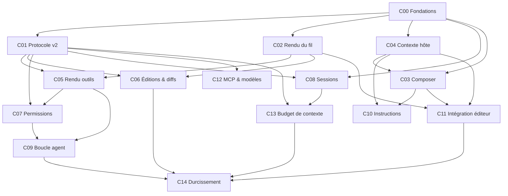

# Blueprint d'implémentation — `agenticenv-chat`

Spécification d'implémentation de l'**extension VS Code**, écrite pour être lue par
des agents de code **sans contexte préalable**.

> **Distinction fondamentale**
>
> - **L'atelier** = [`AgenticEnv`](https://github.com/HadrienT/AgenticEnv) : llama-server,
>   sandbox Docker `agent-server`, serveurs MCP, et le **`openhands-bridge`** (WebSocket).
> - **Ce repo** = `agenticenv-chat` : le **client**. Un panneau de chat dans VS Code,
>   au niveau de finition de GitHub Copilot Chat / Claude Code.
>
> Le blueprint d'AgenticEnv reste la source de vérité pour tout ce qui est
> serveur : [`blueprint/wp/WP08c-chat-client.md`](https://github.com/HadrienT/AgenticEnv/blob/main/blueprint/wp/WP08c-chat-client.md)
> décrit le bridge et le protocole v1. **Les WP de ce blueprint sont préfixés `C`**
> pour ne jamais les confondre avec les `WP##` d'AgenticEnv.

`docs/parity-copilot-claude-code.md` (racine du repo) est le **catalogue de
fonctionnalités** : 124 subtilités numérotées de Copilot et Claude Code. Ce
blueprint le découpe en work packages. Chaque WP déclare **quels numéros du
catalogue il couvre** — la couverture est donc vérifiable.

---

## Règle de lecture

**Tout agent lit `00-PRIMER.md` en premier.** Ensuite, uniquement les fichiers
listés en tête de son work package.

---

## Documents transverses

| Fichier | Contenu | Lire si… |
|---|---|---|
| [00-PRIMER.md](00-PRIMER.md) | Contexte, décisions verrouillées, interdits | **toujours** |
| [01-ARCHITECTURE.md](01-ARCHITECTURE.md) | Couches, frontières, flux de messages, mapping des chemins sandbox↔hôte | vous touchez à plus d'une couche |
| [02-REPOSITORY-TREE.md](02-REPOSITORY-TREE.md) | Arborescence cible, responsabilité fichier par fichier | vous créez des fichiers |
| [03-PROTOCOL.md](03-PROTOCOL.md) | Protocole bridge v2 + contrat hôte↔webview | vous ajoutez un message |
| [04-CONVENTIONS.md](04-CONVENTIONS.md) | Conventions TS/React, thème, CSP, budget de bundle, Definition of Done | **toujours avant de coder** |
| [05-TESTING.md](05-TESTING.md) | Stratégie de test, faux bridge, tests de discipline | **toujours avant de coder** |

---

## Work packages

Chaque WP est **autonome** : contexte, dépendances, livrables, critères
d'acceptation. « Items » renvoie aux numéros de `docs/parity-copilot-claude-code.md`.

| WP | Titre | Dépend de | Parallélisable avec | Items couverts |
|---|---|---|---|---|
| [C00](wp/C00-foundations.md) | Fondations : arborescence de composants, store, thème, tests | — | — | *enabler* |
| [C01](wp/C01-turn-protocol.md) | Protocole v2 : cycle de tour, deltas, annulation | C00 | C02, C04 | 19, 20, 38, 39, 110, 112 |
| [C02](wp/C02-thread-rendering.md) | Rendu du fil : markdown, code, liens, raisonnement | C00 | C01, C04 | 21–29, 32, 33, 34, 44 |
| [C03](wp/C03-composer.md) | Composer : chips de contexte, `/`-commandes, `#`-références, pièces jointes | C00, C04 | C05, C06 | 1, 3–11, 14, 16, 18 |
| [C04](wp/C04-context-providers.md) | Fournisseurs de contexte côté hôte | C00 | C01, C02 | 2, 71–75, 79, 81 |
| [C05](wp/C05-tool-rendering.md) | Rendu des appels d'outils | C01, C02 | C03 | 30, 35, 36, 37, 40, 43, 45 |
| [C06](wp/C06-edits-and-diffs.md) | Éditions, diffs, checkpoints | C01, C02 | C07 | 41, 46–53, 66, 102, 122 |
| [C07](wp/C07-permissions.md) | Permissions, approbations, sûreté | C01, C05 | C06 | 28, 42, 57–60, 107, 114 |
| [C08](wp/C08-sessions.md) | Sessions, historique, édition de la conversation | C00, C01 | C10 | 82–88, 90–93, 105, 106 |
| [C09](wp/C09-agent-loop.md) | Plan, todo, pilotage de la boucle agent | C01, C05, C07 | C08 | 31, 54, 55, 56, 61, 62, 63, 67, 123, 124 |
| [C10](wp/C10-instructions.md) | Instructions, prompts réutilisables, mémoire | C03, C04 | C08 | 15, 76, 77, 78, 117, 118, 119 |
| [C11](wp/C11-editor-integration.md) | Intégration éditeur & commandes VS Code | C02, C03, C04 | C08, C09 | 89, 94–97, 99, 103, 104 |
| [C12](wp/C12-mcp-and-models.md) | MCP opérationnel & sélection de modèle/mode | C01 | C09 | 12, 13, 121 |
| [C13](wp/C13-context-budget.md) | Budget de contexte, compaction, statusline | C01, C08 | C11 | 65, 80, 108, 115, 120 |
| [C14](wp/C14-hardening.md) | Robustesse, accessibilité, packaging, publication | tous | — | 109, 113 |

---

## Graphe de dépendances

---

## Ordre d'exécution recommandé

| Jalon | WP | Ce que l'utilisateur gagne |
|---|---|---|
| **J1 — socle** | C00, C01 | Le fil ne ment plus sur l'état (« agent is working… » fiable), bouton **Stop**, réponse qui se construit au fil de l'eau. |
| **J2 — lisibilité** | C02, C05 | Markdown + code coloré + boutons Copier/Insérer ; les outils ne sont plus du JSON brut. **C'est le plus gros écart visuel avec Copilot.** |
| **J3 — pilotage** | C04, C03 | On choisit ce qu'on envoie : fichier actif, sélection, diagnostics, `#`-références, `/`-commandes. |
| **J4 — édition sûre** | C06, C07 | Diffs dans le fil, checkpoints/undo, approbation de commande avec allowlist. |
| **J5 — confort** | C08, C10, C13 | Sessions persistantes, `CLAUDE.md`, budget de contexte visible. |
| **J6 — profondeur** | C09, C12, C11 | Todo/plan, MCP réellement branché, chat inline et messages de commit. |
| **J7 — publication** | C14 | `.vsix` publiable, accessibilité, CI. |

**Chemin critique minimal pour que l'extension soit agréable au quotidien** :
C00 → C01 → C02 → C05. Les quatre premiers WP suppriment l'essentiel de la dette
et couvrent la majorité de la frustration actuelle.

---

## Dépendances côté AgenticEnv

Plusieurs WP demandent une évolution du **bridge** (repo AgenticEnv,
`packages/openhands-bridge`). Elles sont regroupées ici pour être planifiées
d'un bloc côté serveur :

| Besoin bridge | Demandé par | Détail |
|---|---|---|
| `turn_started` / `turn_finished` / `turn_id` | C01 | remplace l'heuristique client actuelle |
| `cancel_turn` | C01 | bouton Stop |
| deltas de message (`event_delta`) | C01 | rendu incrémental |
| `file_diff {path, unified}` | C06 | diff réel avant/après, pas contre HEAD |
| `checkpoint` / `restore_checkpoint` | C06 | annulation d'un tour |
| `pending_action {kind, command, path, diff}` | C07 | carte de confirmation informative |
| `todo {items}` | C09 | liste de tâches live |
| `interrupt {text}` | C09 | consigne en cours de tour |
| `set_model` / `models` | C12 | sélecteur de modèle |
| MCP `streamable-http` depuis le sandbox | C12 | AgenticEnv WP08b §7 (Phase 2) |
| `context_stats` en continu | C13 | jauge live, pas seulement en fin de tour |

Ces messages sont spécifiés dans [03-PROTOCOL.md](03-PROTOCOL.md). **Aucun ne doit
être simulé côté client** (décision D3 du primer).

---

## Hors périmètre

| Item | Sujet | Raison |
|---|---|---|
| 17 | Entrée vocale | pas de STT local dans l'atelier ; hors sujet. |
| 64 | Sous-agents / délégation | relève du harness OpenHands, pas du client. |
| 68 | Question structurée à choix multiples | image `agent-server` custom — AgenticEnv WP08c Phase 3. |
| 69, 70 | Index sémantique du workspace, sélection auto des fichiers | c'est `kbase` (AgenticEnv WP04–WP06) appliqué au code ; ne se réimplémente pas dans un client. |
| 98 | Génération de tests dans le bon fichier | comportement d'agent, relève des microagents (AgenticEnv WP08). |
| 100, 101 | Suggestions de renommage, Next Edit Suggestions | demandent un modèle d'inline-completion dédié, faible latence — pas ce que sert `llama-server` ici. |
| 111 | Exclusion de contenu par politique d'organisation | notion d'entreprise, sans objet en local. |
| 116 | Niveaux de réflexion (« ultrathink ») | propriété du modèle et du harness, pas du client. |

---

## Ce que ce blueprint ne fait PAS

- Aucune implémentation. Signatures, schémas, contrats, critères d'acceptation.
- Il ne fige pas les API tierces (API VS Code, SDK OpenHands, bibliothèques de
  rendu). Les points `[À CONFIRMER]` se vérifient dans la doc officielle **au
  moment de l'implémentation**, jamais devinés.
